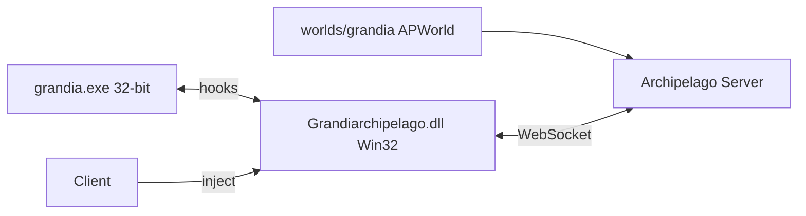

# Grandiarchipelago

Live **Archipelago multiworld** for **Grandia HD Remaster (PC)**.

Grandiarchipelago hooks the running **32-bit native** game and sends/receives checks over the AP server.

## Engine facts (important)

Grandia HD Remaster is a native port (Sickhead Games) built from PlayStation source code, using **SDL + Direct3D**.

## Repository layout

```
Grandiarchipelago/
├── worlds/grandia/                         # Archipelago APWorld (Python)
├── data/                                   # Extracted and mapped Chests / Events
└── tools/
    ├── sync_apworld_from_mdp_catalog.py
    ├── sync_progressions.py
    └── build_grandia_apworld.py
```

## Architecture



## Status

| Milestone | State |
|-----------|-------|
| APWorld scaffold | Done |
| **Chest locations from MDP catalog (v1)** | **Done** — ~800 checks, id `0x47522000+event` |
| Item pool filler/useful from vanilla chests | Done |
| Chests event hooks | Done |
| Story Event hooks | Done |
| Gold hooks | Done |
| Gate hooks | Done |
| StoryEvents / progression logic | Done (needs testing) |
| AP network client | Done |

Sync catalog / progression → APWorld after regenerating MDP data:

```powershell
python tools/sync_progressions.py
python tools/sync_apworld_from_mdp_catalog.py
cmake --build client/build --config Release --target Grandiarchipelago
python build_grandia_apworld.py
```

